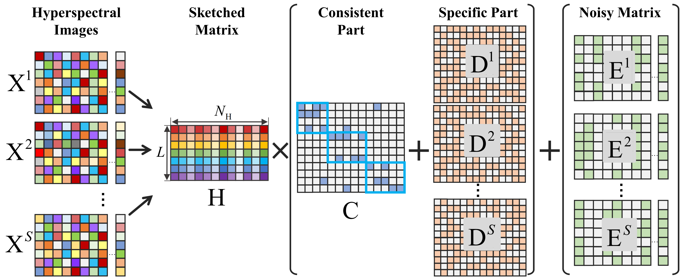

# Sketched Multi-view Subspace Learning for Hyperspectral Anomalous Change Detection

This is a demo of this work implemented in Matlab, written by Shizhen Chang, [Michael Kopp](https://github.com/mkk20) and [Pedram Ghamisi](https://www.pedram-ghamisi.com/).



For more details, please refer to our paper: [Sketched Multi-view Subspace Learning for Hyperspectral Anomalous Change Detection](https://arxiv.org/abs/2210.04271)

## Environment:
* Matlab R2015b

## Files
The package contains the following files.
* [demo.m](demo.m): A demo shows how to run this work.
* [SMSL_ACD.m](SMSL_ACD.m): Implementation of the SMSL model.
* [jlt.m](jlt.m): Calculate the sketched dictionary through JLT random projection.
* [meanjlt.m](meanjlt.m): Calculate the mean sketched dictionary after repeating JLT random projection.
* [roc_i.m](roc_i.m): Calculate the ROC curve.
* [hyperNormalize.m](hyperNormalize.m): Supportive files to normalize the data.

## Usage
* After unzipping the files, put the current directory of Matlab to `mydir`.
* Run `demo.m`.
## Citation
Please cite our paper if you find it is useful for your research.
```
@article{chang2022sketched,
  author={Chang, Shizhen and Kopp, Michael and Ghamisi, Pedram},
  journal={IEEE Transactions on Geoscience and Remote Sensing}, 
  title={Sketched Multi-view Subspace Learning for Hyperspectral Anomalous Change Detection}, 
  year={2022},
  volume={},
  number={},
  pages={1-13},
  doi={10.1109/TGRS.2022.3220814}
  }
```

## Acknowledgment
The authors would like to express their thanks to the creators of [Viareggio](https://ieeexplore.ieee.org/document/7430258) and [BGU-iCVL-hyperspectral-image](https://icvl.cs.bgu.ac.il/hyperspectral/) datasets.

## Notice
This repo is distributed under [MIT License](LICENSE) and is released for scientific purposes only.
